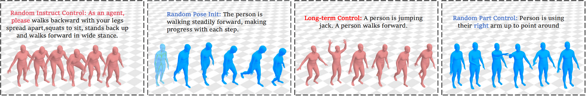
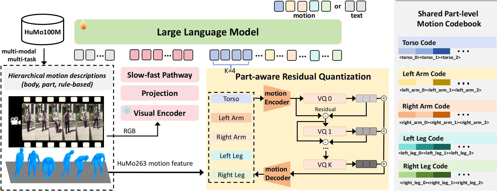

# Being-M0.5: A Real-time Controllable Vision-Language-Motion Model

<div align="center">

[[Website]](https://beingbeyond.github.io/Being-M0.5)
[[arXiv]](https://arxiv.org/abs/2410.03311)

[]()
[]()




</div>
We present HuMo100M, the largest multimodal motion dataset to date, including 5 million motions with fine-grained, long-form, and part-level motion labels. Leveraging our million-scale dataset HuMo100M, we present Being-M0.5, the first real-time, controllable vision-language-motion model (VLMM) that achieves diverse natural language instruction following, flexible pose initialization, long-term motion sequence generation, handling of unseen motion patterns, and precise part-aware motion control.

</div>
More Visualization can be found on our [[Website]](https://beingbeyond.github.io/Being-M0.5).


## Code
We will release our code and part of our dataset soon.

## Citation
If you find our work useful, please consider citing us!
```
@inproceedings{cao2025,
  title={A Real-Time Controllable Vision-Language-Motion Model},
  author={Bin, Cao and Zheng, Sipeng and Ye, Wang and Xia, Lujie and Wei, Qianshan and Jin, Qin and Liu, Jing and Lu, Zongqing},
  booktitle={ICCV},
  year={2025}
}
```
```
@inproceedings{wang2025scaling,
title={Scaling Motion Generation Models with Million-Level Human Motions},
author={Wang, Ye and Zheng, Sipeng and Cao, Bin and Wei, Qianshan and Zeng, Weishuai and Jin, Qin and Lu, Zongqing},
booktitle={International Conference on Machine Learning (ICML)},
year={2025}
}
```